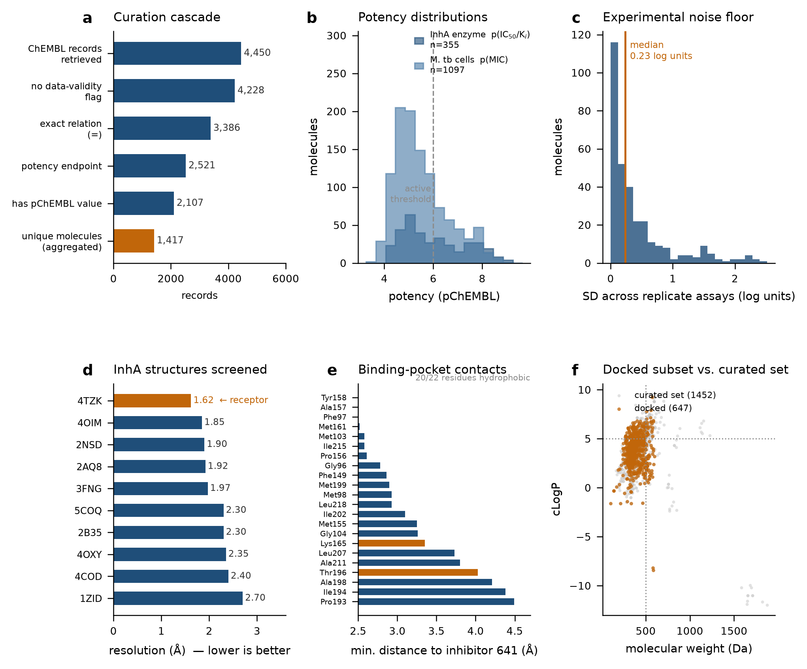
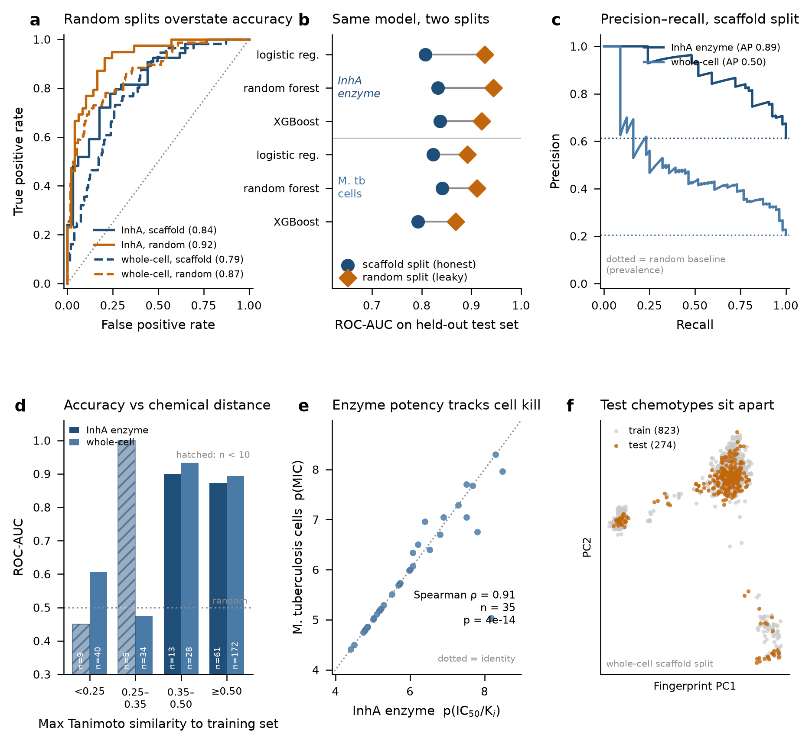
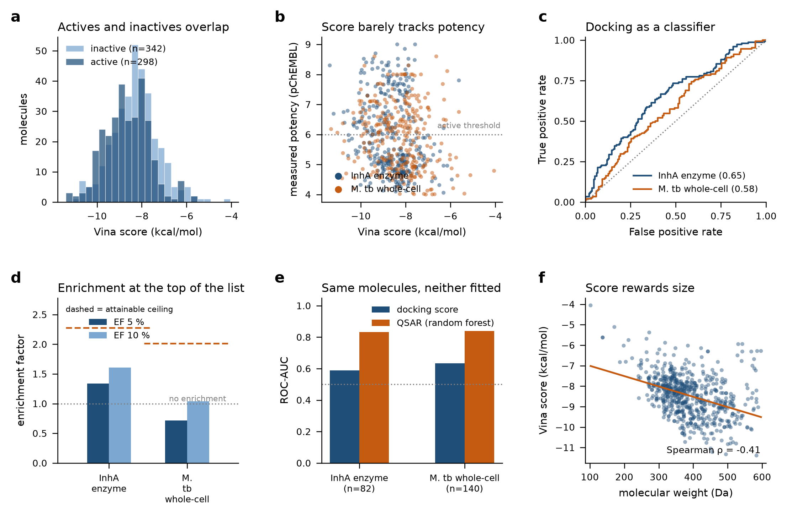
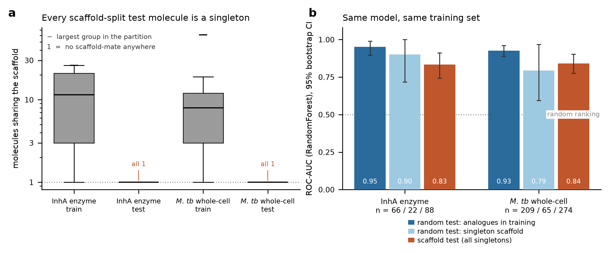
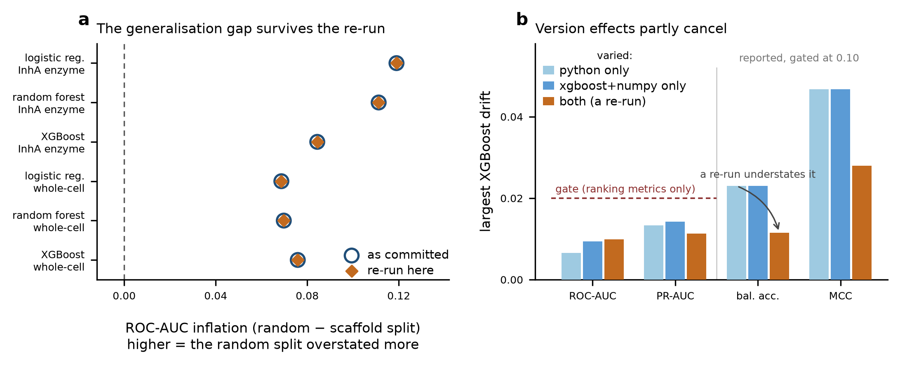

# InhA-TB: structure-based and ligand-based screening against *Mycobacterium tuberculosis*

An end-to-end, reproducible drug-discovery pipeline against **InhA** (enoyl-ACP reductase,
the target of isoniazid) built entirely from public primary data. It couples a validated
AutoDock Vina docking setup with scaffold-split QSAR models, and reports the honest
generalisation gap that most screening write-ups omit.

> **New here?** [Read the 5-page plain-language explainer (PDF)](docs/PROJECT_EXPLAINER_hinglish.pdf) - what was built, what it found,
> and what it does not claim. Written in Hinglish, no code required.

## Headline results

<!-- FACTS:START -->
| | value |
|---|---|
| Redocking control (top-ranked pose vs. crystal) | **0.23 Å** RMSD |
| Compounds in the docking library | 647 |
| Curated bioactivity records | 2,107 → 1,417 unique molecules |
| Enzyme → whole-cell potency correlation | **Spearman ρ = 0.91** (n = 35) |
| InhA classifier, scaffold split (XGBoost) | ROC-AUC **0.84** (random split: 0.92) |
| Whole-cell classifier, scaffold split (RandomForest) | ROC-AUC **0.84** (random split: 0.91) |
| Experimental noise floor (median SD across replicate assays) | 0.23 log units |
| Docking vs. QSAR on the same held-out molecules | ROC-AUC **0.59** / **0.63** vs. **0.83** / **0.84** |

A random train/test split leaks chemical series across the boundary and inflates ROC-AUC by **0.07–0.12** (median 0.08) across all six model × dataset combinations. Every number quoted as a result here is the scaffold-split number.
<!-- FACTS:END -->

*(table above is generated by `src/11_facts.py` from the saved tables - do not hand-edit)*

## Why InhA

InhA is the NADH-dependent enoyl-ACP reductase of the mycobacterial fatty-acid synthase II
system and the validated target of isoniazid, the backbone of first-line TB therapy.
Isoniazid is a prodrug requiring KatG activation, and *katG* mutations are the dominant
clinical resistance mechanism — so **direct** InhA inhibitors that bypass KatG are an
active, well-motivated discovery route.

The dataset supports that logic quantitatively: across the 355 molecules with
InhA enzyme potency and 1097 with whole-cell MIC, the 35 measured in
both correlate at ρ = 0.91. Target engagement translates into
cell kill.

## Data provenance

Every input is public primary data, pulled programmatically — no curated benchmark sets.

| source | what | how |
|---|---|---|
| ChEMBL | InhA enzyme IC50/Ki (CHEMBL1849) and *M. tuberculosis* whole-cell MIC (CHEMBL360) | REST API, paginated, potency-banded |
| RCSB PDB / NCBI MMDB | 10 InhA crystal structures incl. 4TZK (1.62 Å) | coordinate download |
| NCBI Entrez | resolution, method, ligand codes per PDB entry | esummary |

Receptor: **4TZK**, chain A, 1.62 Å, with the NAD cofactor retained — InhA is
NADH-dependent and the inhibitor stacks directly on the nicotinamide ring
(min. ligand–NAD distance 2.2 Å), so removing the cofactor would destroy the pocket.

## Method

1. **Curation** — a printed filter cascade (Figure 1a): validity-comment drop, exact
   relation (`=`) only, potency-endpoint whitelist, usable-unit whitelist, pChEMBL present
   and within [3, 12]. Replicates aggregate to a per-molecule **median** (robust to the
   outliers that pooled multi-lab MICs carry), and the SD across replicates is retained —
   its median is the experimental noise floor, the scale against which model error should
   be read.
2. **Standardisation** — RDKit `rdMolStandardize`: largest-fragment selection, neutralisation,
   canonical tautomer-independent SMILES.
3. **Docking setup** — box centred on the co-crystallised inhibitor (641),
   22.5 × 22.0 × 22.0 Å. Ligands embedded (ETKDG) and
   MMFF-minimised, Meeko-prepared. Library: 647 molecules
   (347 with InhA enzyme potency, 300
   whole-cell), of which 305 are measured actives.
   71 molecules were excluded before docking (max MW
   1876, max rotatable bonds 62), and
   640 of the 647 returned a score.
4. **Validation** — redocking the crystal ligand recovers the experimental pose at
   0.23 Å RMSD. Without this control a docking campaign has no
   evidence its box, protonation, or scoring is set up correctly.
5. **QSAR** — Morgan r=2, 2048 bits + 17 physicochemical descriptors; XGBoost,
   random forest, and an L2 logistic-regression baseline; **Bemis–Murcko scaffold split**
   (large scaffold groups → train, rare/singleton scaffolds → test) with an explicit
   random-split comparison.
6. **Applicability domain** — test compounds binned by max Tanimoto to the training set.

## Figures

<!-- FIGURES:START -->
### Dataset and target



*Curated bioactivity landscape (2,107 records → 1,417 unique molecules), enzyme→whole-cell potency translation (Spearman ρ = 0.91), and the InhA binding site used for docking.*

### QSAR validation



*Scaffold-split performance (XGBoost 0.84 on InhA, RandomForest 0.84 whole-cell), the random-split inflation gap, and accuracy as a function of chemical distance.*

### Docking screen



*Score distributions, score vs. measured potency, ROC, and the head-to-head on held-out molecules: docking 0.59/0.63 vs. QSAR 0.83/0.84 ROC-AUC.*
<!-- FIGURES:END -->

### Leakage decomposition



*(a) Scaffold-group size by partition: the scaffold-split test set is entirely singletons,
by construction. (b) Inside the random split - one model, one training set - test molecules
with training analogues outrank singleton-scaffold molecules; error bars are 95% bootstrap
CIs and are wide on the singleton arm (n = 22 and 65). Generated by
`src/22_figure_leakage.py` from `data/leakage_decomposition.csv`.*

*(gallery generated by `src/11_facts.py` - do not hand-edit)*

## Is the gap leakage, or are rare scaffolds just hard?

The scaffold split assigns the **largest** scaffold groups to train, so the test set ends
up entirely singleton scaffolds (`figures/fig5_leakage.png`, panel a: median group size
11.5 in train, exactly 1 in test). That leaves an alternative explanation for the
gap: singleton molecules might be intrinsically harder — one-off papers, more exotic
chemistry, noisier assays — in which case the gap is not leakage at all.

`src/21_leakage_decomposition.py` separates the two without training anything new. Inside
the **random** split, where the training set is fixed and the model is one model, the test
set is partitioned by whether the molecule's scaffold occurs more than once in the dataset:

| random-split test subset | InhA | *M. tb* whole-cell |
|---|---|---|
| analogues present in training | 0.95 | 0.93 |
| singleton scaffold (no analogue anywhere) | 0.90 | 0.79 |
| *scaffold*-split test set, for reference | 0.83 | 0.84 |

Two things follow. The analogue subset scores higher than the singleton subset in
**6/6** model × dataset combinations
(median +0.099 ROC-AUC), which is the leakage mechanism visible at
the level of individual molecules rather than inferred from a split-level difference. And
the singleton subset lands near the scaffold-split value (median residual
-0.006), which is what leakage predicts and what the
"singletons are just hard" explanation does not.

**How strong is this evidence?** Weaker than the consistent direction suggests, and the
figure shows why: the singleton arm has only 22 and 65 molecules (9 actives in the smaller
one), so its own ROC-AUC carries a 95% CI up to 0.48 wide. Every per-combination
difference has a CI crossing zero. Pooling both datasets for the random forest gives
delta +0.065 [-0.025, +0.169], permutation *p* = 0.084 — **not significant at the
conventional threshold**. Two of six individual permutation tests reach *p* < 0.05, both on
the whole-cell dataset. So: direction consistent and mechanism-consistent, effect size not
established. The headline claim of this repo does not rest on this test — the
scaffold-split numbers are the reported ones either way — but the *explanation* for the
gap is supported, not proven.

## Honest limitations

- **The head-to-head runs on a label-selected subset.** Docking covers
  140 of the 274 whole-cell scaffold-split test molecules
  (82/88 on InhA). The shortfall is not random: `src/06` samples a class-balanced
  docking library from a dataset that is only 20% active, so the
  109 never-sampled test molecules are **all inactives**, and active prevalence in the
  head-to-head set rises from 0.20 to 0.36 (Fisher
  *p* < 1e-4). A further 25 are excluded by the documented MW <= 600 / RotB <= 12 envelope,
  which is label-neutral (active rate 0.24 vs. 0.20 base). QSAR's ranking
  performance is unchanged between the full test set and the docked subset
  (0.841 vs. 0.839 ROC-AUC), so the subset is not a generally easier
  evaluation set — it is a *docking-favourable* one, and the selection therefore works
  against the reported conclusion rather than for it. Enrichment factors are **not**
  comparable across the two sets (the attainable EF5 ceiling moves from 4.89 to 2.80),
  which is why only ROC-AUC is quoted from the head-to-head.
- **Vina score is not affinity.** Empirical scoring functions correlate weakly with measured
  potency. This pipeline claims *prioritisation*, not affinity prediction.
<!-- AD:START -->
- **Accuracy is a function of chemical distance.** Test compounds at Tanimoto similarity >= 0.35 to the training set score ROC-AUC 0.87–0.93; below 0.35 the same model falls to 0.47–0.60 — at, or barely above, chance. Predictions on
  genuinely novel chemotypes are not trustworthy, and Figure 2d shows it rather
  than hiding it. (2 similarity bins hold fewer than 10
  compounds; they are hatched in the figure and excluded from these ranges rather than
  quoted as results.)
<!-- AD:END -->

- **Rigid receptor.** InhA's substrate-binding loop is known to be flexible; a single rigid
  conformation cannot capture induced fit.
- **Activity cliffs.** Fingerprint models are structurally blind to potency cliffs within
  a series.
- **Assay heterogeneity.** ChEMBL MICs come from many labs and protocols; the retained
  inter-replicate spread quantifies but does not remove this.

## License

MIT — see [LICENSE](LICENSE). The curated bioactivity data derives from ChEMBL
(CC BY-SA 3.0) and the receptor from PDB 4TZK; cite those sources, not this repo,
for the underlying measurements.

## Reproduce

```bash
conda env create -f environment.yml && conda activate inha-tb
./run_all.sh                        # the whole chain, steps 1-22 (docking is the slow part)
```

Individual steps:

```bash
python src/01_fetch_chembl.py       # ChEMBL pull -> data/chembl_raw.json (optional: the
                                    #   repo ships data/chembl_raw.json.gz, so step 2 runs
                                    #   from a clone without re-querying ChEMBL)
python src/02_curate.py             # filter cascade, standardise, aggregate replicates
python src/03_features.py           # fingerprints, descriptors, scaffold + random splits
python src/04_train_qsar.py         # models, metrics.csv, curves.json, applicability domain
python src/05_prepare_receptor.py   # 4TZK -> receptor.pdbqt + box.json
python src/06_build_library.py      # docking library + 3D conformers
python src/07_redock_validate.py    # CONTROL: asserts RMSD < 2 A vs the crystal pose
python src/08_dock_library.py       # Vina screen (slow; parallel workers)
python src/09_analyse_docking.py    # docking score vs measured potency
python src/10_figures.py            # figures 1-2, from the saved tables alone
python src/11_facts.py              # regenerate docs/facts.json + README generated blocks
python src/12_methods_doc.py        # regenerate docs/METHODS.md from the same tables
python src/13_figure_docking.py     # figure 3, from the docking join
```

### What reproduces, and what drifts



**(a)** The random-split ROC-AUC exceeds the scaffold-split ROC-AUC for every model on
both datasets, in the committed tables and on a re-run under newer libraries; only the
XGBoost points move at all. **(b)** XGBoost drift attributed to each factor, measured on
three interpreters (`src/20_version_attribution.py`). Changing python alone moves MCC by
0.047; changing xgboost and numpy alone moves it by the same amount; changing both moves it
by only 0.028, because the two effects partly cancel. **A single re-run therefore does not
bound the drift** - the endpoint comparison a reviewer would make is not the worst case.
Random forest and logistic regression are bit-identical in all three environments. Held-out
sets are n = 88 (InhA enzyme) and n = 274 (whole-cell).

The exact versions that produced the committed tables are recorded in
`environment.lock.json`; `environment.yml` now pins every library that touches a reported
number to its minor version. `src/18_check_reproducibility.py` re-trains from the committed
data in a temporary copy, says whether you are on the reference versions, and bounds the
difference. Measured across three interpreters (python 3.11.16 / 3.13, xgboost 3.2.0 /
3.4.1 - see `src/20_version_attribution.py`):

| component | behaviour on a re-run |
|---|---|
| scaffold and random splits | invariant in **membership**, not just in size - the Bemis-Murcko split sorts by group size then name, so it is deterministic by construction, not by seed. `data/splits.json` is byte-identical across all three environments |
| fingerprints, descriptors | `data/fp_matrix.npy` bitwise identical; descriptors agree to 2e-16 |
| random forest, logistic regression | bit-identical in all three environments |
| XGBoost ROC-AUC, PR-AUC | up to 0.010 / 0.015. Gated at 0.02 |
| XGBoost MCC, balanced accuracy | up to 0.047 / 0.024. These threshold the probability at 0.5, so a shift of ~1e-3 in one prediction relabels a molecule and moves the metric by ~1/n_test. Reported, and gated only at 0.10 |
| EF5 | up to 0.753, and not gated - at n_test = 88 the top 5% is 4 molecules, so a single rank change moves EF5 by ~0.35 |

Two caveats on those bounds, both found by measuring rather than assuming. First, the drift
is **not monotonic in version distance**: python 3.11 -> 3.13 alone moves MCC further
(0.047) than the full jump to newer xgboost and numpy does (0.028). Bounds taken from a
single re-run understate the worst case, so the table above is the worst pairwise drift
across the three environments, not the endpoint difference. Second, python itself - not
xgboost - is the largest single contributor, which is why the pins in `environment.yml`
include the interpreter.

Two headline figures move by 0.01 in the third decimal and would round differently
(InhA XGBoost scaffold 0.837 -> 0.834, random 0.921 -> 0.931); the two random-forest
headline numbers do not move at all. The head-to-head docking comparison is unaffected,
because `src/09_analyse_docking.py` uses the random forest.

The claim this repo is built on survives the drift: scaffold-split ROC-AUC stays below
random-split ROC-AUC in all six model x dataset combinations, and the inflation range is
0.07-0.12 in both the committed and the regenerated tables. The check exits non-zero if
that ordering ever breaks - which is the failure that would actually matter.

`environment.yml` pins to minor versions rather than exact builds: exact pins would freeze
the numbers but make the environment unsolvable within a year or two. Minor pins hold the
numbers where they were measured, `environment.lock.json` records the exact reference, and
bounding the residual drift while gating the claim covers the rest,
and it is what the check does.

## Layout

```
data/        curated activity tables, features, splits, metrics
structures/  PDB coordinates + per-entry metadata
dock/        receptor, box, ligand library, poses, scores
figures/     publication-grade figures
src/         numbered, runnable pipeline steps
docs/        generated methods write-up + facts.json (single source of numbers)
```
